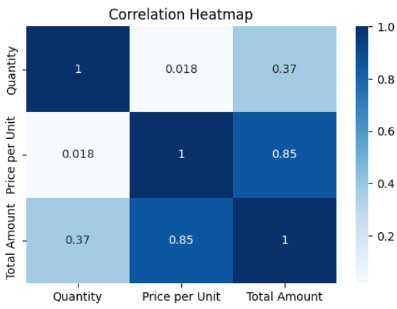

# Exploratory Data Analysis on Retail Sales Dataset

## Objective
This project presents an **Exploratory Data Analysis (EDA)** of a retail sales dataset containing transaction-level data.  
The objective is to understand **customer behaviour, product performance, and sales trends** using Python-based visualization and statistical techniques.

---

## Data Description
The dataset consists of **1000 rows** and **9 columns**.  

**Features:**
- **Transaction ID (int)** – Unique ID for each transaction  
- **Date (datetime)** – Date of purchase  
- **Customer ID (object)** – Unique ID for customer  
- **Gender (object)** – Gender of the customer  
- **Age (int)** – Age of the customer  
- **Product Category (object)** – Category of purchased product  
- **Quantity (int)** – Number of units sold  
- **Price Per Unit (int)** – Price for each category  
- **Total Amount (int)** – Total bill amount  

---

## Libraries Used
- **Pandas** – Data manipulation and analysis  
- **Matplotlib** – Visualization  
- **Seaborn** – Advanced plots  

---

## Exploratory Data Analysis
EDA is the first step in working with data.  
Purpose: **Reveal insights, relationships, and potential issues (like missing values or outliers)**.  
We use **visualizations and summary statistics** to explore features and distributions.

---

## Data Cleaning
- Checked for **missing values** → None found  
- Checked for **duplicates** → None found  
- Each customer has **only 1 transaction**  
- **Clothing** category has the highest sales, followed by **Electronics**  
- **Electronics** contributed **₹156,905 revenue (849 units sold)**  

---

## Feature Engineering
New features created from existing data:  
- **Month**  
- **Day of Week**  
- **Hour**  
- **Weekend vs Weekday**  

---

## Data Visualization & Insights

### Product Category Revenue
- **Electronics & Beauty** → Highest average unit price  
- **Clothing** → Lower prices but higher sales volume  

---

### Gender Distribution
- **Females** form the majority of buyers  

---

### Age Distribution
- Even spread with peaks at **30–35** and **50–55** years  
- Younger and middle-aged customers show strong engagement  

---

### Monthly Trends
- **May** → Highest sales  
- **September** → Lowest sales  

---

### Day-wise Sales
- **Saturday** → Peak sales  
- **Sunday** → Significant dip  

---

### Spending Across Age Groups
- Spending is **widely distributed**  
- Both genders show **similar spending patterns**  

---

### Correlation
- **Price per Unit ↔ Total Amount** → Strong positive correlation  
- **Quantity ↔ Total Amount** → Weak correlation  

---

### Quantity Distribution by Category
- **Clothing** → Bought in larger, more varied quantities  
- **Beauty & Electronics** → Fewer, consistent quantities  

---

## Conclusion
From the analysis, businesses can:  
- **Promote clothing in bundles/discounts** to increase total revenue  
- Maintain strong stock and **premium marketing** for electronics & beauty items  
- Use **female-oriented campaigns** for higher engagement  
- Stock products for **age groups 30–35 & 50–55**, especially in top categories  
- Launch **major promotions in March, April, June, and October**  
- Offer **midweek bundle discounts** to drive weekday traffic  
- Use **inclusive branding**, since both genders show similar spending habits  
- Segment customers into **price-sensitive vs. value-driven** for targeted offers  
- Boost lower-volume categories with **combo offers/cross-category bundles**  

✅ By leveraging these insights, the company can **improve sales strategies, enhance customer satisfaction, and increase overall profitability**.  

---
